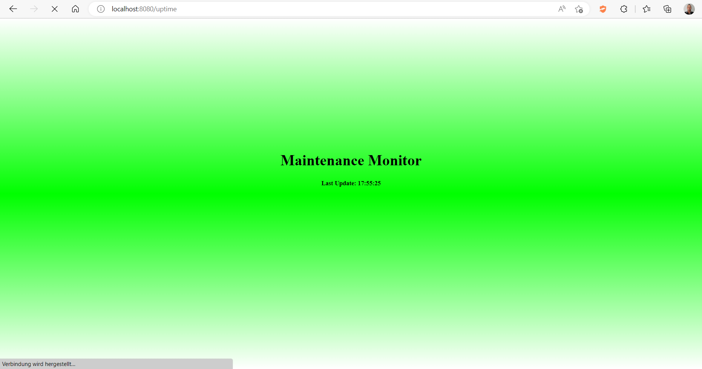
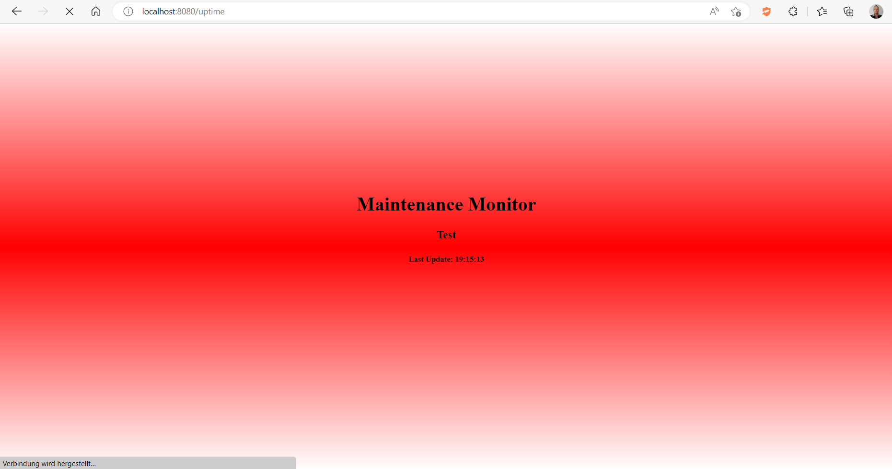

# Maintenance-Monitor

[](https://github.com/ic21b023/Veruch2/actions/workflows/maven.yml)


## Funktionsbeschreibung
Nach dem Start ist der Maintenance-Monitor über den Pfad localhost:8080/uptime, ohne Übergabe von Parametern, wird bei Erfolg der Maintenance-Monitor als HTML-Seite und der Statuscode 200 (OK) zurückgegeben. Beim Verwenden eines Webbrowsers wird der Maintenance-Monitor visualisiert. 
Es wird die Überschrift (Maintenance-Monitor), eine Nachricht (wenn vorhanden) und die Zeit angezeigt, wann die Nachricht empfangen/aktualisiert wurde (Aktualisierungszeit-Lastupdatetime).
Ist keine Nachricht vorhanden ist der Hintergrund grün. Ist eine Nachricht vorhangen, so ist der Hintergrund rot.

Über localhost:8080/uptime/setMessage, mit dem Content-Type "text/plain", kann ein beliebiger Text als Nachricht an den Maintenance-Monitor übergeben werden. Wurde die Nachricht erfolgreich empfangen, so wird der Statuscode 200 (OK) zurückgegeben. Der Hintergrund wechselt auf rot und es wird die Zeit (Aktualisierungszeit-Lastupdatetime) angezeigt wann die Nachricht aktualisiert wurde.

Mit dem Aufruf von localhost:8080/uptime/reset, ohne Übergabe von Parametern, kann die aktuelle Nachricht gelöscht werden. Beim erfolgreichen Löschen der Nachricht wird der Statuscode 200 (OK) zurückgegeben, die Zeit wann die Nachricht empfangen wurde, angezeigt und der Hintergrund ist grün.
Der Maintenance-Monitor wird alle 5 Sekunden automatisch aktualisiert um beim Nachrichtenempfang/aktualisieren/löschen die Nachricht, den Hintergrund und die Aktualisierungszeit-Lastupdatetime dementsprechend zu ändern.

## Beschreibung der Pfade

```sh
(GET) => localhost:8080/uptime (ohne Parameter)
```
gibt den Maintenance-Monitor als HTML-Seite zurück. Der Hintergrund ist grün, wenn keine Nachricht vorhanden bzw. leer ist. 
Wenn eine Nachricht vorhanden ist, ist der Hintergrund rot.



```sh
(PUT) => localhost:8080/uptime/setMessage (Content-Type "text/plain" mit einem Text)
```
setzt die Nachricht des Maintenance-Monitors und die Aktualisierungszeit-Lastupdatetime. Der Hintergrund ist rot.



```sh
(DELETE) => localhost:8080/uptime/reset (ohne Parameter)
```
löscht die Nachricht des Maintenance-Monitor. Der Hintergrund ist grün. 

